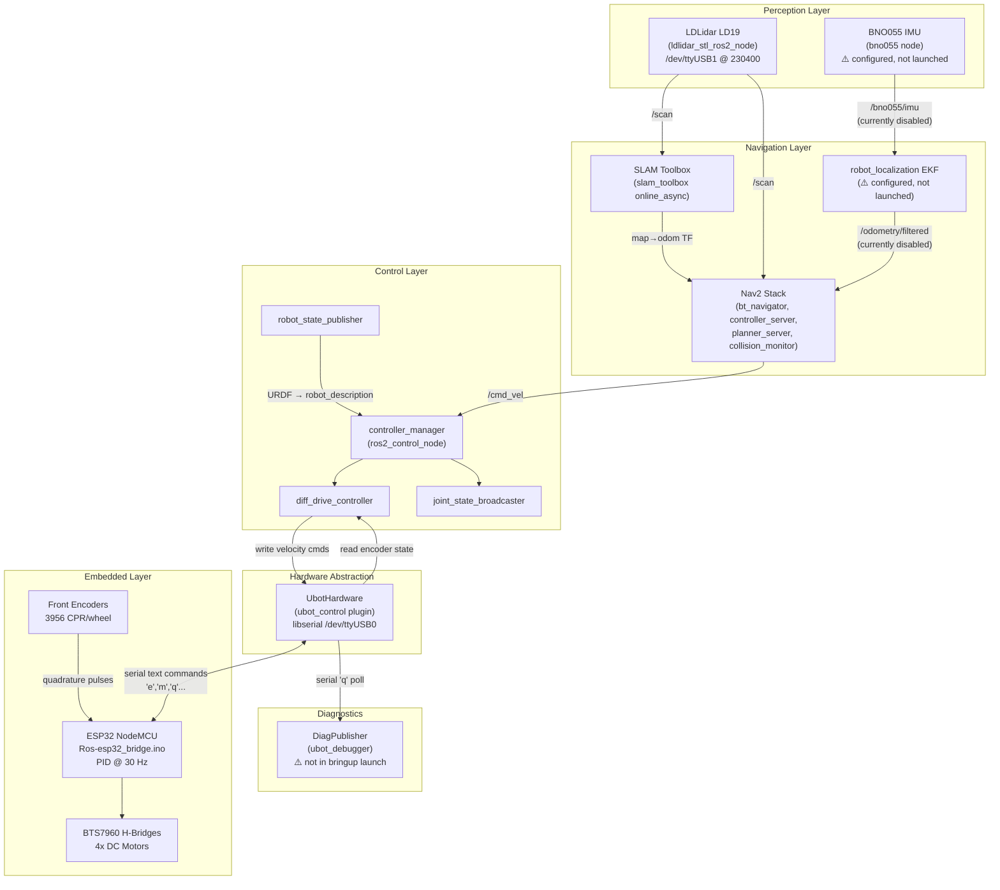

# Architecture Overview

The ubot system is a ROS2 differential-drive mobile robot platform. This page describes the high-level layered architecture and how the major subsystems interact.

---

## System layers

---

## Data flow: `/cmd_vel` to wheel motion

A navigation command (`geometry_msgs/Twist` on `/cmd_vel`) travels through the following chain:

1. Nav2 `controller_server` or teleoperation node publishes `/cmd_vel`.
2. `twist_stamper` node converts `Twist` → `TwistStamped`, remapped to `/diff_drive_controller/cmd_vel`.
3. `diff_drive_controller` receives the stamped command and converts it to per-wheel velocity targets using kinematic equations (wheel_separation=0.264204 m, wheel_radius=0.033 m).
4. `UbotHardware::write()` translates wheel velocity targets to ticks-per-frame and sends `'m <L> <R>\r'` over `/dev/ttyUSB0` @ 115200 baud.
5. `Ros-esp32_bridge.ino` receives the command, updates `TargetTicksPerFrame` for each wheel PID, and resets the 10-second auto-stop watchdog.
6. `diff_controller.h` `updatePID()` runs at 30 Hz: reads encoder counts (interrupt-safe), applies Jimeno low-pass RPM filter, runs PID (Kp=5, Ki=9, Kd=0), applies dead-zone feedforward offset (±minPwm=50), drives BTS7960 H-bridges.
7. Motors rotate. Encoder pulses feed back into the PID loop.

---

## Data flow: encoder state to odometry

1. `Ros-esp32_bridge.ino` reads encoder counts when it receives command `'e'`.
2. `UbotHardware::read()` sends `'e\r'`, parses `"<leftTicks> <rightTicks>\r\n"`, updates wheel position state interfaces.
3. `diff_drive_controller` reads position state, integrates encoder differentials using the same kinematics, publishes:
   - `/diff_drive_controller/odom` (`nav_msgs/Odometry`) at 30 Hz.
   - `odom → base_footprint` TF at ~30 Hz.
4. Downstream: Nav2's `bt_navigator` and `velocity_smoother` consume `/diff_drive_controller/odom` directly (EKF-fused `/odometry/filtered` is currently commented out).

---

## Subsystem summary

| Subsystem | ROS packages involved | Primary config |
|---|---|---|
| Hardware interface | ubot_control, controller_manager | ubot_ros2_control.xacro, ubot_controllers.yaml |
| Differential drive control | ros2_controllers (diff_drive_controller) | ubot_controllers.yaml |
| LiDAR | ldlidar_stl_ros2 | real_robot.launch.py (inline params) |
| IMU (inactive) | bno055 | bno055_params.yaml |
| EKF (inactive) | robot_localization | real_ekf.yaml |
| SLAM mapping | slam_toolbox | mapper_params_online_async.yaml |
| Navigation | nav2_bringup | nav2_params.yaml |
| Diagnostics | ubot_debugger | diag_publisher.py (not in bringup launch) |
| Simulation | gz_ros2_control, gz-sim | sim.launch.py, sim_ubot_controllers.yaml, sim_nav2_params.yaml |

---

## Robot naming note

The workspace uses two names for the same hardware:

- **`ubot`** — the ROS package family name and `robot_description` name (`<robot name="ubot">`). Used everywhere in package names, URDF, TF frames.
- **"Horizon"** — an informal hardware name appearing in `ubot_controllers.yaml` header comment ("Real-hardware controller configuration for Horizon") and in the orphaned firmware `hacker.ino` ("Horizon Mini Robot"). This is the same physical robot; "ubot" is the software identity.

Do not interpret "Horizon" as a different robot. See [Embedded Firmware](../hardware/embedded.md) for details on the firmware duality.

---

## Real maps on disk

Active SLAM Toolbox map saves in `/home/chibueze/uni-bot/`:

| Map name | Files |
|---|---|
| studio_1 | studio_1_save.pgm, studio_1_save.yaml, studio_1_serial.data, studio_1_serial.posegraph |
| studio_2 | studio_2_save.pgm, studio_2_save.yaml, studio_2_serial.data, studio_2_serial.posegraph |
| studio_3 | studio_3_save.pgm, studio_3_save.yaml (resolution=0.050, origin=[-3.844,-2.408,0]), studio_3_serial.data, studio_3_serial.posegraph |
| Tee_map | Tee_map_save.pgm, Tee_map_save.yaml, etc. |
| defence_map | defence_map_save.pgm, defence_map_save.yaml, etc. |

The `mapper_params_online_async.yaml` config references `/home/chibueze/uni-bot/studio_3_serial` as its map file path — update this when switching environments.
