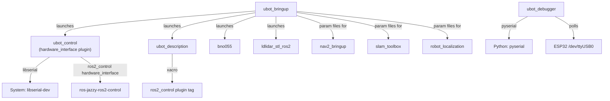

# Package Structure

This page describes the on-disk layout of the ubot workspace and the role of every package.

---

## Workspace tree

```
/home/chibueze/uni-bot/              ← colcon workspace root
├── build/                           ← colcon build artefacts (not in version control)
├── install/                         ← installed packages (not in version control)
├── log/                             ← colcon + ROS2 log output
├── studio_1_save.{pgm,yaml}         ← real SLAM Toolbox map saves from prior runs
├── studio_1_serial.{data,posegraph}
├── studio_2_save.{pgm,yaml}
├── studio_2_serial.{data,posegraph}
├── studio_3_save.{pgm,yaml}         ← studio_3 referenced in mapper_params_online_async.yaml
├── studio_3_serial.{data,posegraph}
├── Tee_map_save.{pgm,yaml}
├── Tee_map_serial.{data,posegraph}
├── defence_map_save.{pgm,yaml}
├── defence_map_serial.{data,posegraph}
├── frames_2026-04-17_*.{gv,pdf}     ← TF tree captures from ros2 run tf2_tools view_frames
├── frames_2026-06-26_17.33.00.{gv,pdf}   ← most recent TF capture
└── src/                             ← colcon source space (this repo)
    ├── WORKSPACE.md                 ← informal structure listing (may be stale, not authoritative)
    ├── WORKSPACE_AUDIT.md           ← 17-item issue audit (partially stale — see Known Issues)
    ├── INSTALL.md                   ← installation instructions
    ├── mkdocs.yml                   ← MkDocs site configuration
    ├── docs/                        ← this documentation site source
    ├── bno055/                      ← vendored BNO055 IMU driver
    ├── ldlidar_stl_ros2/            ← vendored LDLidar LD19 driver (LIVE on real robot)
    ├── sllidar_ros2/                ← vendored RPLiDAR driver (not used on real robot currently)
    ├── Ros-esp32_bridge/            ← LIVE ESP32 firmware (Arduino sketch)
    ├── esp32/hacker/                ← ORPHANED micro-ROS firmware — do NOT use with ros2_control
    └── ubot/                        ← first-party ROS2 packages
        ├── ubot_bringup/
        ├── ubot_control/
        ├── ubot_debugger/
        └── ubot_description/
```

---

## Package inventory

### First-party packages (`ubot/`)

#### `ubot_bringup`
- **Build type**: ament_cmake
- **Version**: 0.0.0, License: BSD-3-Clause
- **Role**: Launch coordinator and configuration hub for all first-party nodes. Contains all YAML config files for ros2_control, Nav2, robot_localization, and SLAM Toolbox.
- **Key contents**:
  - `launch/real_robot.launch.py` — real-hardware bringup (6 nodes)
  - `launch/sim.launch.py` — Gazebo simulation bringup
  - `launch/laptop_slam_nav2.launch.py` — SLAM + Nav2 (Nav2 portion commented out)
  - `launch/display.launch.py` — RViz2 for visualisation
  - `launch/bno055.launch.py` — IMU standalone launch
  - `launch/test_wheels.launch.py` — ⚠️ EMPTY FILE, will fail if launched
  - `config/ubot_controllers.yaml`, `sim_ubot_controllers.yaml`
  - `config/nav2_params.yaml`, `sim_nav2_params.yaml`, `original_nav2_params.yaml`
  - `config/real_ekf.yaml`, `sim_ekf.yaml`
  - `config/bno055_params.yaml`
  - `config/mapper_params_online_async.yaml`
- **See**: [ubot_bringup](../packages/ubot_bringup.md)

#### `ubot_control`
- **Build type**: ament_cmake
- **Version**: 0.0.0, License: BSD-3-Clause
- **Role**: `ros2_control` hardware_interface plugin. Provides the `UbotHardware` SystemInterface that bridges between ros2_control state/command interfaces and the ESP32 over libserial.
- **Key contents**:
  - `include/ubot_control/ubot_hardware_interface.hpp`
  - `src/ubot_hardware_interface.cpp` — `UbotHardware::on_init/read/write` implementation
  - `include/ubot_control/arduino_comms.hpp` — serial command wrapper (send `'e'`, `'m'`, `'q'`, etc.)
  - `include/ubot_control/wheel.hpp` — per-wheel state struct
  - `hardware_interface_plugin.xml` — pluginlib registration as `ubot_control/UbotHardware`
- **See**: [ubot_control](../packages/ubot_control.md)

#### `ubot_debugger`
- **Build type**: ament_python
- **Version**: 0.0.0, License**: ⚠️ literally "TODO" in package.xml
- **Role**: Polls the ESP32 via serial `'q'` command at up to 15 Hz and republishes the 14-field diagnostic frame as individual `std_msgs/Float64` topics for visualisation in PlotJuggler or RQT.
- **Key contents**:
  - `ubot_debugger/diag_publisher.py` — `DiagPublisher` node
- **Note**: Not included in any bringup launch file — must be run manually.
- **See**: [ubot_debugger](../packages/ubot_debugger.md)

#### `ubot_description`
- **Build type**: ament_cmake
- **Version**: 0.0.0, License: BSD-3-Clause
- **Role**: Robot model (URDF/xacro), mesh files, and RViz configurations.
- **Key contents**:
  - `urdf/body/ubot_robot.urdf.xacro` — top-level xacro, includes all sub-xacros
  - `urdf/body/ubot_base.urdf.xacro` — base_footprint + base_link geometry
  - `urdf/body/ubot_wheel.urdf.xacro` — 4 wheel joints + links
  - `urdf/sensors/ubot_lidar.urdf.xacro` — lidar_link
  - `urdf/sensors/ubot_imu.urdf.xacro` — imu_link
  - `urdf/sensors/ubot_camera.urdf.xacro` — camera_link tree
  - `urdf/sensors/ubot_ultrasonic.urdf.xacro` — ultrasonic sensor links
  - `urdf/ros2_control/ubot_ros2_control.xacro` — `<ros2_control>` tag, hardware/joint interfaces
  - `urdf/gazebo/ubot_gazebo.urdf.xacro` — Gazebo sensor plugins (gpu_lidar, rgbd_camera, IMU)
  - `urdf/gazebo/gazebo_control.xacro` — ⚠️ DEAD FILE, not included anywhere
  - `rviz/` — RViz2 config files
- **See**: [ubot_description](../packages/ubot_description.md)

---

### Vendored driver packages

#### `bno055`
- **Build type**: ament_python
- **Version**: 0.5.0, License: BSD
- **Origin**: flynneva/ros2-bno055 (upstream open-source)
- **Role**: Driver for the Bosch BNO055 9-DOF IMU over I2C or UART.
- **Key source**: `bno055/sensor/SensorService.py` (411 lines) — all publisher/service logic
- **Published topics** (prefix configurable, default `bno055/`): `imu_raw`, `imu`, `mag`, `grav`, `temp`, `calib_status`
- **Service**: `calibration_request` (std_srvs/Trigger)
- **See**: [bno055](../packages/bno055.md)

#### `ldlidar_stl_ros2`
- **Build type**: ament_cmake
- **Version**: 3.0.0, License: MIT
- **Role**: Driver for LDRobot LD-series LiDAR sensors. The **LIVE** LiDAR driver on the real robot (LD19 model, `/dev/ttyUSB1` @ 230400 baud).
- **Published topic**: `/scan` (sensor_msgs/LaserScan), frame_id=`lidar_link`
- **Launch files**: 6 variant launch files (A1, A2, LD06, LD19, LD06new, LD14) — `real_robot.launch.py` launches the node directly with inline params rather than using these launch files.
- **See**: [ldlidar_stl_ros2](../packages/ldlidar_stl_ros2.md)

#### `sllidar_ros2`
- **Build type**: ament_cmake
- **Version**: 1.0.1, License: BSD
- **Role**: Driver for Slamtec RPLiDAR sensors. NOT used on the real robot currently — `real_robot.launch.py` launches ldlidar_stl_ros2, not sllidar. Retained in workspace for potential future use or simulation scenarios.
- **Launch files**: 24 model-specific launch files (A1–C3, S1–S2, etc.)
- **See**: [sllidar_ros2](../packages/sllidar_ros2.md)

---

### Firmware (not a ROS2 package)

#### `Ros-esp32_bridge/` — LIVE firmware
- **Language**: Arduino/C++
- **Key files**: `Ros-esp32_bridge.ino`, `diff_controller.h`, `encoder_driver.h/.ino`, `motor_driver.h/.ino`, `DualBTS7960MotorShieldESP32.h/.cpp`, `commands.h`
- **Role**: Receives text commands over USB serial from `UbotHardware`, runs 30 Hz RPM PID, drives BTS7960 H-bridges, streams 14-field diagnostics over Serial2.

#### `esp32/hacker/` — ORPHANED firmware
- **Key file**: `hacker.ino`
- **Role**: Alternative micro-ROS firmware that subscribes directly to `/cmd_vel` and publishes to `/horizon/*` topics, completely bypassing `ros2_control`. **Do not flash this firmware alongside the ros2_control stack.** Contains a known internal pin-comment mismatch (see [Known Issues](issues.md)).

---

## Dependency graph


