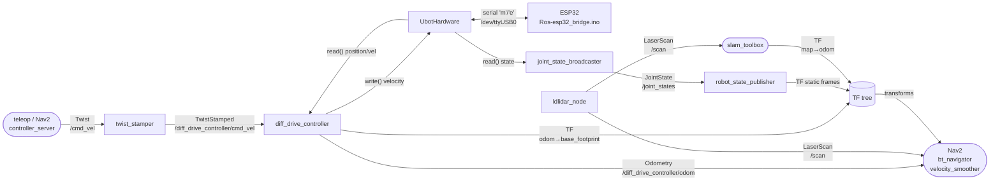

# ROS Graph

This page documents every ROS2 topic, service, and action connection in the live real-robot graph as derivable from source. Topic names, message types, and QoS profiles are taken directly from source code and configuration files — not from a live `ros2 topic list` capture.

> **Note on scope**: Third-party nodes (Nav2 servers, SLAM Toolbox, robot_localization) expose far more internal topics than listed here. This page focuses on the inter-subsystem connections that matter for understanding and debugging the ubot system.

---

## Node inventory

### Active on real robot (`ros2 launch ubot_bringup real_robot.launch.py`)

| Node name | Package | Executable | Purpose |
|---|---|---|---|
| `robot_state_publisher` | robot_state_publisher | robot_state_publisher | Publishes robot_description + static TF tree |
| `ros2_control_node` | controller_manager | ros2_control_node | Hardware interface manager + controller lifecycle |
| (spawned) `joint_state_broadcaster` | ros2_controllers | spawner | Publishes `/joint_states` at 30 Hz |
| (spawned) `diff_drive_controller` | ros2_controllers | spawner | Differential-drive kinematics + odometry |
| `twist_stamper` | twist_stamper | twist_stamper | Converts `Twist` → `TwistStamped` |
| `ldlidar_node` | ldlidar_stl_ros2 | ldlidar_stl_ros2_node | LDLidar LD19 laser scan publisher |

### Configured but NOT launched in `real_robot.launch.py`

| Node name | Package | Why excluded |
|---|---|---|
| `bno055` | bno055 | Node defined at line 101 but `# bno055_node,` commented out at line 125 |
| `ekf_filter_node` | robot_localization | Entire Node() block commented out, lines 110-116 |

### Run separately (diagnostics)

| Node name | Package | How to run |
|---|---|---|
| `horizon_diag_publisher` | ubot_debugger | `ros2 run ubot_debugger diag_publisher` |

---

## Topics

### Published by real-robot bringup nodes

| Topic | Message Type | Publisher | QoS | Notes |
|---|---|---|---|---|
| `/scan` | sensor_msgs/LaserScan | ldlidar_node | BestEffort, depth=10 (driver default) | frame_id=lidar_link, 12m range, ~8Hz (LD19 spec); topic_name param set in real_robot.launch.py |
| `/diff_drive_controller/odom` | nav_msgs/Odometry | diff_drive_controller | Reliable, depth=10 (controller default) | 30 Hz; odom_frame_id=odom, base_frame_id=base_footprint |
| `/joint_states` | sensor_msgs/JointState | joint_state_broadcaster | Reliable (controller default) | All 4 joints; rear joints mirror front position/velocity |
| `/robot_description` | std_msgs/String | robot_state_publisher | transient_local | URDF string, published once on startup |
| `/tf` | tf2_msgs/TFMessage | robot_state_publisher + diff_drive_controller | Reliable | Includes odom→base_footprint (dynamic, 30 Hz) + all static frames |
| `/tf_static` | tf2_msgs/TFMessage | robot_state_publisher | latched | base_footprint→base_link, all sensor frames |
| `/cmd_vel` | geometry_msgs/Twist | teleoperation / Nav2 | ⚠️ QoS depends on publisher | twist_stamper subscribes here; collision_monitor also outputs here (post-filtering) |
| `/diff_drive_controller/cmd_vel` | geometry_msgs/TwistStamped | twist_stamper | ⚠️ matches diff_drive_controller subscriber QoS | Remapped from twist_stamper `/cmd_vel_out` |

### Published when BNO055 and EKF are enabled (currently inactive)

| Topic | Message Type | Publisher | QoS | Notes |
|---|---|---|---|---|
| `/bno055/imu_raw` | sensor_msgs/Imu | bno055 node | depth=10 | Raw quaternion + accel + gyro |
| `/bno055/imu` | sensor_msgs/Imu | bno055 node | depth=10 | Fused orientation, quaternion manually normalized (see Known Issues) |
| `/bno055/mag` | sensor_msgs/MagneticField | bno055 node | depth=10 | Magnetometer data |
| `/bno055/grav` | geometry_msgs/Vector3 | bno055 node | depth=10 | Gravity vector |
| `/bno055/temp` | sensor_msgs/Temperature | bno055 node | depth=10 | Chip temperature |
| `/bno055/calib_status` | std_msgs/String | bno055 node | depth=10 | JSON string: sys/gyro/accel/mag calibration levels 0-3 |
| `/odometry/filtered` | nav_msgs/Odometry | ekf_filter_node | ⚠️ robot_localization default | EKF output fusing odom0 + imu0 |

### Published by Nav2 (when running separately)

| Topic | Message Type | Notes |
|---|---|---|
| `/map` | nav_msgs/OccupancyGrid | Served by map_server / slam_toolbox |
| `/cmd_vel_smoothed` | geometry_msgs/Twist | velocity_smoother output; collision_monitor input |
| `/cmd_vel` | geometry_msgs/Twist | collision_monitor final output (post obstacle check) |
| `/local_costmap/costmap` | nav2_msgs/Costmap | local voxel+inflation costmap |
| `/global_costmap/costmap` | nav2_msgs/Costmap | global static+obstacle+inflation costmap |
| `/plan` | nav_msgs/Path | NavfnPlanner (A*) global path |

### Published by diagnostic node (`horizon_diag_publisher`, when run manually)

All `std_msgs/Float64`, depth=10. Polled from ESP32 via `'q'` command at `publish_rate` Hz (default 10 Hz):

| Topic | Content |
|---|---|
| `/horizon/diag/enc/left` | Raw left encoder count |
| `/horizon/diag/enc/right` | Raw right encoder count |
| `/horizon/diag/rpm/left_target` | Left wheel RPM target |
| `/horizon/diag/rpm/right_target` | Right wheel RPM target |
| `/horizon/diag/rpm/left_actual` | Left wheel filtered RPM (Jimeno LPF) |
| `/horizon/diag/rpm/right_actual` | Right wheel filtered RPM |
| `/horizon/diag/pid/left_error` | Left PID error |
| `/horizon/diag/pid/right_error` | Right PID error |
| `/horizon/diag/pid/left_integral` | Left PID integral accumulator |
| `/horizon/diag/pid/right_integral` | Right PID integral accumulator |
| `/horizon/diag/pid/left_output` | Left PID output (raw, pre-deadzone) |
| `/horizon/diag/pid/right_output` | Right PID output (raw, pre-deadzone) |
| `/horizon/diag/vel/linear` | Estimated linear velocity (m/s) from RPM |
| `/horizon/diag/vel/angular` | Estimated angular velocity (rad/s) from RPM |

---

## Services

| Service | Type | Server | Notes |
|---|---|---|---|
| `/bno055/calibration_request` | std_srvs/Trigger | bno055 node | Switches BNO055 to config mode, reads calibration offsets, returns as string. Only available when bno055 node is running. |
| `/controller_manager/*` (multiple) | ros2_control_interfaces | ros2_control_node | Standard lifecycle/spawner services — not ubot-specific |
| `/diff_drive_controller/set_parameters` | rcl_interfaces/SetParameters | diff_drive_controller | Standard ROS2 parameter service |

---

## Actions

No custom ROS2 actions are defined in this workspace. Nav2 exposes standard actions (`/navigate_to_pose`, `/navigate_through_poses`, `/follow_path`, etc.) — see [Nav2 documentation](https://docs.nav2.org) for their interface definitions.

---

## ROS graph by role

---

## QoS summary

| Layer | Typical profile |
|---|---|
| ros2_control (state/command interfaces) | Internal to process — not a topic |
| diff_drive_controller odometry | Reliable, keep_last=10 |
| LiDAR scan | BestEffort, keep_last=10 (ldlidar driver default) |
| TF / TF_static | Reliable/latched |
| Diagnostic topics (diag_publisher) | Reliable, depth=10 |
| BNO055 topics | QoSProfile(depth=10) — Reliable, keep_last=10 |
| Nav2 internal | Varies by server — see nav2 source |
