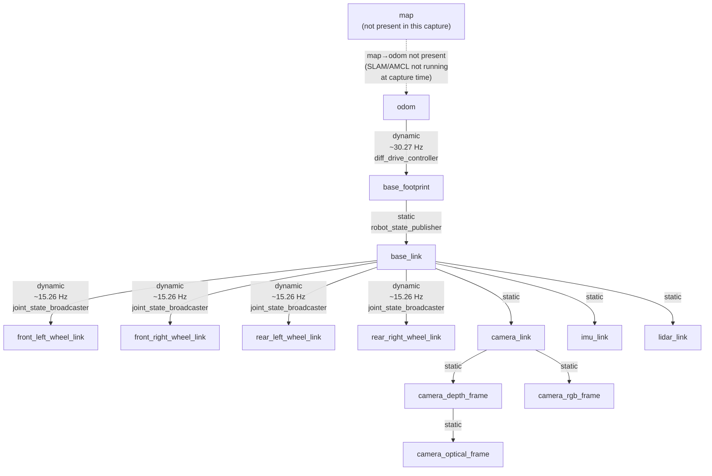

# TF Tree

This page documents the TF frame tree for the ubot robot, using a real captured `view_frames` output as ground truth.

---

## Ground-truth capture

The frame graph below is derived from the most recent TF capture in the workspace:

**File**: `/home/chibueze/uni-bot/frames_2026-06-26_17.33.00.gv`  
**Captured at**: Unix timestamp 1782491580.006 (2026-06-26 17:33:00 UTC)  
**Tool**: `ros2 run tf2_tools view_frames`  
**State at capture**: real robot running with `real_robot.launch.py` (ros2_control + diff_drive_controller + ldlidar active; bno055 and EKF disabled per bringup config)

Multiple earlier captures exist in the workspace root (`frames_2026-04-17_*.gv` through `frames_2026-06-26_*.gv`), documenting TF tree evolution across ~2 months of development.

---

## Frame tree

---

## Frame descriptions

| Frame | Type | Broadcaster | Rate (Hz) | Origin in URDF |
|---|---|---|---|---|
| `map` | Dynamic | slam_toolbox (when running) | ⚠️ not present in this capture | Published by SLAM Toolbox / AMCL |
| `odom` | Dynamic (root of dynamic tree) | diff_drive_controller | ~30.27 Hz | Odometry integration origin |
| `base_footprint` | Dynamic child of odom | diff_drive_controller | ~30.27 Hz (same TF message) | Ground projection of robot centre |
| `base_link` | Static child of base_footprint | robot_state_publisher | static (10000.0 in view_frames convention) | Robot centroid, at ground level |
| `front_left_wheel_link` | Dynamic | joint_state_broadcaster | ~15.26 Hz | Offset from base_link per ubot_wheel.urdf.xacro |
| `front_right_wheel_link` | Dynamic | joint_state_broadcaster | ~15.26 Hz | " |
| `rear_left_wheel_link` | Dynamic | joint_state_broadcaster | ~15.26 Hz | " |
| `rear_right_wheel_link` | Dynamic | joint_state_broadcaster | ~15.26 Hz | " |
| `camera_link` | Static | robot_state_publisher | static | Origin: [0.205, 0, 0.162618] from base_link |
| `camera_depth_frame` | Static | robot_state_publisher | static | Child of camera_link |
| `camera_optical_frame` | Static | robot_state_publisher | static | Child of camera_depth_frame |
| `camera_rgb_frame` | Static | robot_state_publisher | static | Child of camera_link |
| `imu_link` | Static | robot_state_publisher | static | Origin: [-0.0101, 0.0148, 0.18] from base_link |
| `lidar_link` | Static | robot_state_publisher | static | Origin: [-0.1425, 0, 0.2147] from base_link |

---

## Observed discrepancies

### 1. No `map` frame at capture time

The `map→odom` edge is absent. At the moment of capture, neither SLAM Toolbox nor any localization node (AMCL, EKF) was broadcasting this transform. This is expected if the bringup was run without also starting slam_toolbox or map_server. Nav2 requires a valid `map→odom` transform to plan; without it, global planning will fail with a TF lookup timeout.

**Impact**: operational — whenever you launch Nav2, you must also launch slam_toolbox (or provide a static `map→odom` via a map server). The slam_toolbox config in `mapper_params_online_async.yaml` will broadcast this edge when running.

### 2. Wheel TF rate (~15.26 Hz) is half the configured controller rate (30 Hz)

`controller_manager.update_rate: 30` and `diff_drive_controller.publish_rate: 30.0` (from `ubot_controllers.yaml`) suggest all controller output should be at 30 Hz. However, the captured `view_frames` output shows wheel-joint TF edges at ~15.26 Hz — approximately half.

**Possible explanations** (cannot be determined definitively from source alone):
- The `joint_state_broadcaster` in the installed ros2_control version may default to a different publish rate than the controller_manager update rate.
- The `view_frames` tool samples a fixed window; if the broadcaster and tool are slightly out of phase, the measured rate can be half the real rate.
- A second render: `view_frames` measures the rate of _new_ transforms in its buffer, which for wheel joints rotating slowly may appear lower than for the odom edge.

> ⚠️ **Could not be determined from source — requires runtime inspection.** Use `ros2 topic hz /joint_states` and `ros2 topic hz /tf` to measure actual rates.

### 3. `odom→base_footprint` vs separate odom and base_footprint edges

In some ros2_control configurations, `diff_drive_controller` publishes a single TF message with parent=`odom` and child=`base_footprint`. The `base_footprint→base_link` static transform is then published separately by `robot_state_publisher`. This matches the capture — the chain is odom → base_footprint (dynamic) → base_link (static).

Nav2 uses `global_frame: map` and `robot_base_frame: base_footprint`, so it needs the full chain: map→odom→base_footprint. SLAM Toolbox is configured with `odom_frame: odom`, `map_frame: map`, `base_frame: base_footprint` (from `mapper_params_online_async.yaml`), which correctly maps to this chain.

---

## Frames expected when IMU and EKF are enabled

When `bno055_node` and `ekf_filter_node` are re-enabled in `real_robot.launch.py`:

1. `bno055_node` will publish `/bno055/imu` with `frame_id: imu_link`. The imu_link is already in the TF tree (static, from URDF).
2. `ekf_filter_node` will fuse `/diff_drive_controller/odom` and `/bno055/imu` (yaw angular velocity only, per `real_ekf.yaml`), and publish `/odometry/filtered` with a TF broadcast of `odom→base_footprint` (overriding the diff_drive_controller broadcast for that edge, since EKF's `publish_tf: true`).

> ⚠️ Both `diff_drive_controller` (`enable_odom_tf: true`) and `ekf_filter_node` (`publish_tf: true`) will broadcast `odom→base_footprint` if both are enabled simultaneously. This creates a TF conflict. You must set `enable_odom_tf: false` in `ubot_controllers.yaml` once the EKF is re-enabled.

---

## Sensor frame offsets (from URDF)

| Sensor frame | x (m) | y (m) | z (m) | Roll | Pitch | Yaw |
|---|---|---|---|---|---|---|
| `lidar_link` | -0.1425 | 0 | 0.2147 | 0 | 0 | 0 |
| `imu_link` | -0.0101 | 0.0148 | 0.18 | 0 | 0 | 0 |
| `camera_link` | 0.205 | 0 | 0.162618 | 0 | 0 | 0 |

All offsets measured from `base_link`. Note that the LiDAR is mounted **behind** the centre (negative x) while the camera is **in front** (positive x).
