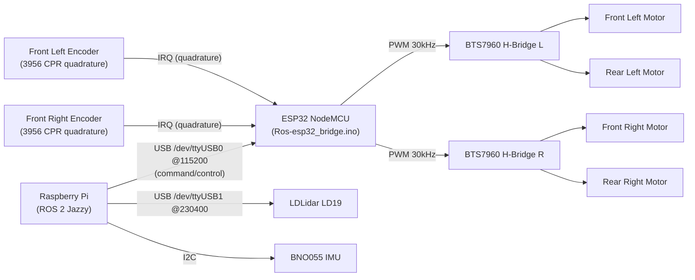

# Hardware Overview

This page documents the physical hardware platform of the ubot differential-drive robot (informal internal name: "Horizon").

---

## Compute Architecture

The robot uses a two-processor split: a Raspberry Pi handles all ROS 2 logic while an ESP32 handles hard-real-time motor control.

| Role | Device | Responsibility |
|---|---|---|
| Host SBC | Raspberry Pi | Runs ROS 2 Jazzy; controller\_manager, diff\_drive\_controller, Nav2, SLAM Toolbox, all Python/C++ nodes |
| Motor controller | ESP32 NodeMCU | Runs `Ros-esp32_bridge.ino`; manages BTS7960 H-bridges; runs 30 Hz PID loop |

**Communication between Pi and ESP32:**

| Channel | Path | Baud | Purpose |
|---|---|---|---|
| Command/control | USB serial `/dev/ttyUSB0` | 115200 | Single-character command protocol (encoder reads, motor setpoints, PID updates). This is the channel used by `ubot_control/UbotHardware`. |
| Diagnostics only | Serial2 GPIO 16 (TX) | 115200 | Continuous 14-field diagnostic stream + periodic debug lines. Intended for PlotJuggler or `ubot_debugger/diag_publisher`. **Does not carry command traffic.** |

> The `q` command (diagnostics-on-demand) lets `diag_publisher.py` retrieve the same diagnostic snapshot over the main USB channel without requiring a second serial port to be wired.

---

## Chassis

| Parameter | Value | Source |
|---|---|---|
| Drive topology | 4WD differential drive | `ubot_wheel.urdf.xacro` |
| Caster wheel | None | `ubot_wheel.urdf.xacro` |
| Base dimensions (L x W x H) | 0.41 x 0.2371 x 0.2025 m | `ubot_base.urdf.xacro` |
| Base mass | 3.0 kg | `ubot_base.urdf.xacro` |
| Wheel radius | 0.033 m | `ubot_wheel.urdf.xacro`, `diff_controller.h` |
| Wheel separation (track width) | 0.264204 m | `ubot_wheel.urdf.xacro`, `diff_controller.h` |
| Wheel width | 0.0264 m | `ubot_wheel.urdf.xacro` |
| Wheel mass | 0.4 kg each | `ubot_wheel.urdf.xacro` |

**Encoder configuration:** Front wheels have quadrature encoders (3956 CPR). Rear wheels are mechanically slaved to the front wheels on the same side; they have no independent encoders. `diff_drive_controller` uses only the front wheel joints for odometry.

**Drive electronics:** Two BTS7960 43A H-bridge modules — one per side. Each H-bridge drives the front and rear motors on its side simultaneously (series/parallel wiring), giving a single PWM-controlled output per side.

---

## Motor and Encoder Specifications

Values come from `diff_controller.h` in `Ros-esp32_bridge.ino`.

| Parameter | Left | Right |
|---|---|---|
| Encoder CPR (`ENC_CPR`) | 3956 | 3956 |
| PWM frequency | 30 kHz (ESP32 ledc API) | 30 kHz |
| PWM resolution | 8-bit (0–255) | 8-bit (0–255) |
| Dead-zone / min PWM | 50 | 50 |
| PID control rate | 30 Hz | 30 Hz |
| PID gains (Kp / Ki / Kd) | 5.0 / 9.0 / 0.0 | 5.0 / 9.0 / 0.0 |
| Integral anti-windup clamp | ±50.0 | ±50.0 |
| Output clamp | ±255 | ±255 |
| Auto-stop timeout | 10 s (`CMD_TIMEOUT_MS`) | 10 s |

> **Note:** The source code comment at `diff_controller.h` line 44 states: *"Starting gains — re-tune after flashing (previous values were calibrated with a double min\_pwm bug)"*. The current PID gains are explicitly marked as unvalidated starting values pending re-calibration. See `issues.md` for tracking.

---

## Sensors

| Sensor | Status on real robot | Interface | Notes |
|---|---|---|---|
| LDLidar LD19 | **ACTIVE** | `/dev/ttyUSB1` @ 230400 baud | Primary navigation sensor |
| Bosch BNO055 IMU | **CONFIGURED, not launched** | I2C | Defined in `real_robot.launch.py` but excluded from `LaunchDescription` |
| RGB-D camera | **URDF + Gazebo only** | — | No driver node in any launch file |
| Ultrasonic (left/right) | **URDF only** | — | No driver, no ROS topic |

### LDLidar LD19

- 2D rotating laser rangefinder
- Spin rate: ~8 Hz; range: 12 m; 720 samples/scan
- ROS topic: `/scan` (sensor\_msgs/LaserScan), frame\_id: `lidar_link`
- Connection: `/dev/ttyUSB1` @ 230400 baud (USB serial adapter)
- Driver: `ldlidar_stl_ros2` (vendored, v3.0.0, MIT license)
- Angle cropping: disabled in `real_robot.launch.py` (`enable_angle_crop_func=False`)

### BNO055 IMU

- Bosch BNO055, 9-DOF (accelerometer + gyroscope + magnetometer)
- Interface: I2C; operation mode: NDOF (Bosch internal 9-DOF sensor fusion)
- Mount position: P2 (configured in `bno055_params.yaml`, applied via axis-remap registers)
- Driver: `bno055` package (vendored, v0.5.0, BSD license)
- The node is **defined** in `real_robot.launch.py` (lines ~101–107) but the line that adds it to the `LaunchDescription` is commented out (line 125). The robot currently navigates on wheel odometry only. To enable: uncomment the `bno055_node` line in `real_robot.launch.py`.

### RGB-D Camera

- URDF and Gazebo simulation definitions are present (camera\_link at [0.205, 0, 0.163] m from base\_link).
- No camera driver node exists in any launch file. TF frames are published (static) but no image topics are produced on the real robot.
- Physical model could not be determined from source — the URDF comment references an Intel RealSense D435 mass value (72 g) but this is not confirmed. Requires runtime inspection.

### Ultrasonic Sensors

- Two links defined in `ubot_ultrasonic.urdf.xacro` (left and right).
- No ROS driver node, no published topic, not referenced by Nav2 costmaps.
- Likely aspirational/placeholder hardware.

---

## Hardware Connection Diagram

> The Serial2 GPIO 16 diagnostic stream (ESP32 → Pi) is not shown as it is a one-way diagnostic-only path and is not part of the command/control flow.

---

## Power

> **Could not be determined from source.** No battery, power management board, or voltage-rail information was found anywhere in the workspace. This requires runtime/hardware inspection to document accurately.
