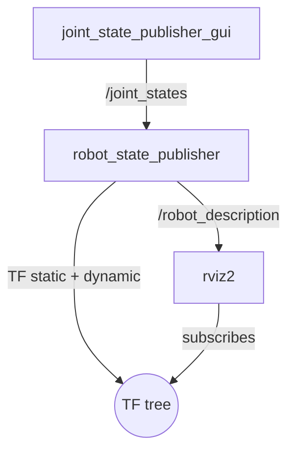

# display.launch.py

A URDF visualisation launch file from the `ubot_description` package. It starts `robot_state_publisher`, `joint_state_publisher_gui`, and RViz2 — giving you an interactive 3D view of the robot model with manually moveable joints. This is primarily used for URDF verification and TF tree inspection without needing any hardware.

Source: `/home/chibueze/uni-bot/src/ubot/ubot_description/launch/display.launch.py`

## Quick start

```bash
ros2 launch ubot_description display.launch.py
```

To use a custom URDF/xacro path:

```bash
ros2 launch ubot_description display.launch.py model:=/path/to/your/robot.urdf.xacro
```

## Arguments

| Argument | Default | Description |
|---|---|---|
| `model` | `ubot_description/urdf/body/ubot_robot.urdf.xacro` | Absolute path to the URDF or xacro file to display |

The `model` argument is passed directly to `xacro` via a `Command` substitution. The default invokes xacro without any additional arguments (no `use_gazebo:=true/false` is passed — the xacro default of `use_gazebo:=false` applies).

## Launched nodes

| Node name | Package | Executable | Key parameters |
|---|---|---|---|
| `robot_state_publisher` | `robot_state_publisher` | `robot_state_publisher` | `robot_description` from xacro processing of `model` arg |
| `joint_state_publisher_gui` | `joint_state_publisher_gui` | `joint_state_publisher_gui` | No extra parameters |
| `rviz2` | `rviz2` | `rviz2` | Config: `ubot_description/rviz/display.rviz` |

### What each node does

**`robot_state_publisher`** — Parses the URDF and publishes the static TF frames (base_footprint → base_link, base_link → wheel_links, base_link → sensor_links) plus the `/robot_description` parameter. It depends on `/joint_states` to compute dynamic transforms for moveable joints.

**`joint_state_publisher_gui`** — Opens a small slider GUI for every non-fixed joint in the URDF. Moving a slider updates `/joint_states`, which causes `robot_state_publisher` to update the TF tree in real time. For the ubot this means the four wheel joints (continuous type) each get a position slider.

**`rviz2`** — Opens with the saved `display.rviz` configuration which shows the robot model (RobotModel display), TF frames, and a fixed frame set to `base_footprint`.

## Use cases

**URDF/xacro verification** — After editing any xacro file, launch this to confirm the model renders without errors. Xacro parse errors appear in the terminal; geometry errors are visible in RViz.

**TF tree inspection** — All static transforms are visible in the TF display. Use `ros2 run tf2_tools view_frames` in a separate terminal to capture a `.gv`/`.pdf` of the full TF tree while this launch is running.

**Pre-run model check** — Verify link positions, frame orientations, and mesh paths are correct before committing to a real robot run.

**Joint limit checking** — The `joint_state_publisher_gui` sliders respect the URDF joint limits. For continuous joints (wheels) the slider wraps around, confirming the joint type is configured correctly.

## Topic graph



## Notes

- `use_sim_time` is not set in any node in this launch file. All nodes run with `use_sim_time: false` (the ROS 2 default). This is correct for offline URDF inspection.
- The RViz config `display.rviz` is separate from `slam.rviz` used by `laptop_slam_nav2.launch.py` and `sim.launch.py`. It is a simpler config focused on model display rather than mapping/navigation.
- No controllers, no hardware interface, no LiDAR, no camera bridge — this is purely a model visualisation tool.

## Known issues

None specific to this launch file.

## See also

- [real_robot.launch.py](real_robot.md) — also starts `robot_state_publisher`, but with hardware
- [URDF description](../packages/ubot_description.md)
- [Architecture: TF tree](../architecture/tf_tree.md)
