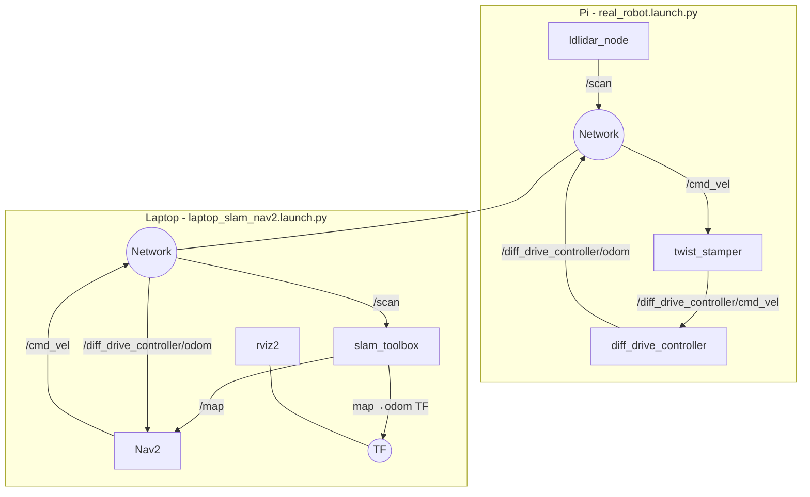

# laptop_slam_nav2.launch.py

A compute-offload launch file intended to run on a laptop while the Raspberry Pi handles hardware bringup. Despite what the filename implies, **Nav2 is fully included and active** in this file. Both SLAM Toolbox and Nav2 run from this single launch — the intended split is that the Pi runs `real_robot.launch.py` (hardware, controllers, LiDAR) while the laptop runs this file (SLAM, navigation, visualisation).

> **Correction to earlier audit**: the crib sheet note that "Nav2 is COMMENTED OUT" was based on an older revision. Reading the current source confirms Nav2 is active. See the source at `/home/chibueze/uni-bot/src/ubot/ubot_bringup/launch/laptop_slam_nav2.launch.py`.

## Quick start

```bash
# On the Raspberry Pi (robot):
ros2 launch ubot_bringup real_robot.launch.py

# On the laptop (same ROS_DOMAIN_ID, same network):
ros2 launch ubot_bringup laptop_slam_nav2.launch.py
```

Ensure both machines share the same `ROS_DOMAIN_ID` and can reach each other over the network (multicast or configured `ROS_DISCOVERY_SERVER`).

## Arguments

None. This launch file does not declare any `DeclareLaunchArgument` entries.

## Launched nodes and actions

| Action | Package / source | Key configuration |
|---|---|---|
| SLAM Toolbox (`online_async_launch.py`) | `slam_toolbox` | Config: `ubot_bringup/config/mapper_params_online_async.yaml`; `use_sim_time: false` |
| `rviz2` | `rviz2` | Config: `ubot_description/rviz/slam.rviz`; `use_sim_time: false` |
| Nav2 (`navigation_launch.py`) | `nav2_bringup` | Config: `ubot_bringup/config/nav2_params.yaml`; `use_sim_time: false` |

### SLAM Toolbox configuration highlights

From `mapper_params_online_async.yaml`:

| Parameter | Value |
|---|---|
| `mode` | `mapping` |
| `solver_plugin` | `solver_plugins::CeresSolver` |
| `odom_frame` | `odom` |
| `map_frame` | `map` |
| `base_frame` | `base_footprint` |
| `transform_publish_period` | `0.02` s (50 Hz) |
| `resolution` | `0.05` m |
| `max_laser_range` | `12.0` m |
| Loop closure | enabled |

### Nav2 uses real-robot parameters

This file loads `nav2_params.yaml` (the real robot config, **not** `sim_nav2_params.yaml`). Key nav2 settings:

- `odom_topic`: `/diff_drive_controller/odom` — subscribes directly to wheel odometry (not EKF output)
- `max_vel_x`: 0.15 m/s, `max_vel_theta`: 0.6 rad/s
- `inflation_radius`: 0.30 m (both local and global costmaps)
- Local planner: DWB (`dwb_core::DWBLocalPlanner`)
- Global planner: NavFn with A* (`use_astar: true`)

## Intended use case

The ubot's Raspberry Pi has limited compute. Running SLAM Toolbox, Nav2, and RViz simultaneously on the Pi while also managing hardware I/O causes CPU contention. This launch file offloads the heavy compute tasks to a laptop:

```
Raspberry Pi                    Laptop
─────────────────               ──────────────────────────────────────
real_robot.launch.py            laptop_slam_nav2.launch.py
  robot_state_publisher           slam_toolbox  → /map, TF map→odom
  controller_manager              nav2 stack    → /cmd_vel goal tracking
  joint_state_broadcaster         rviz2         → visualisation
  diff_drive_controller
  twist_stamper
  ldlidar_node (LD19)
      │
      └──── /scan, /joint_states, /diff_drive_controller/odom
            (DDS multicast across network)
```

The LiDAR scan (`/scan`) and odometry (`/diff_drive_controller/odom`) are produced on the Pi and consumed by SLAM Toolbox and Nav2 running on the laptop. Nav2's velocity commands (`/cmd_vel`) flow back across the network to the twist_stamper on the Pi.

## Topic graph



## Known issues

| Ref | Description | Severity |
|---|---|---|
| — | No network configuration guidance is included in the launch file itself. Cross-machine ROS 2 DDS requires either multicast support or explicit `ROS_DISCOVERY_SERVER` / `FASTDDS_DEFAULT_PROFILES_FILE` configuration. | Low |
| — | Nav2's `odom_topic` is `/diff_drive_controller/odom` (raw wheel odometry). If `ekf_filter_node` is later enabled in `real_robot.launch.py`, the nav2_params.yaml `odom_topic` should be updated to `/odometry/filtered` to use fused odometry. | Low |

## See also

- [real_robot.launch.py](real_robot.md) — the Pi-side companion launch file
- [sim.launch.py](sim.md) — all-in-one simulation launch (includes Nav2)
- [Configuration: nav2_params.yaml](../configuration/nav2_params.md)
- [Configuration: mapper_params_online_async.yaml](../configuration/slam_toolbox_params.md)
