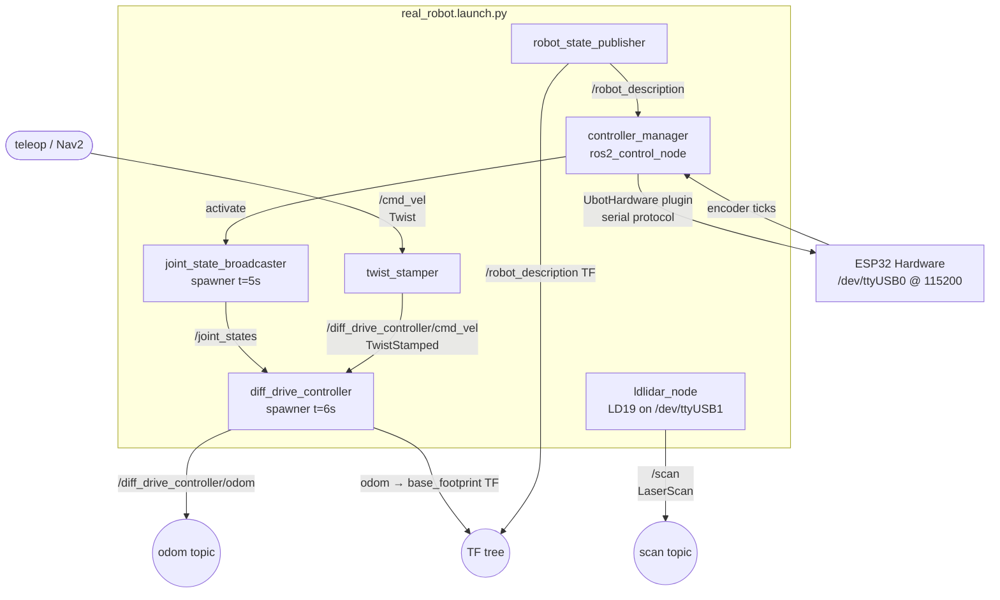

# real_robot.launch.py

The primary bringup launch file for the physical robot. It starts all nodes required for driving the ubot: hardware interface, controllers, LiDAR, and the twist stamper that bridges teleop to the controller. IMU and EKF are defined in this file but are not currently launched — see [Known issues](#known-issues).

## Quick start

```bash
ros2 launch ubot_bringup real_robot.launch.py
```

No command-line arguments are accepted. All configuration is hardcoded via YAML files and inline parameters.

**Prerequisites:**

- ESP32 flashed with `Ros-esp32_bridge.ino` connected on `/dev/ttyUSB0` at 115200 baud.
- LD19 LiDAR connected on `/dev/ttyUSB1` at 230400 baud.
- Workspace built and sourced (`source install/setup.bash`).

## Arguments

None. This launch file does not declare any `DeclareLaunchArgument` entries. The xacro command is constructed with `use_gazebo:=false` hardcoded.

## Launched nodes

Nodes are listed in the order they appear in the returned `LaunchDescription`.

| Node name | Package | Executable | Key parameters |
|---|---|---|---|
| `robot_state_publisher` | `robot_state_publisher` | `robot_state_publisher` | `robot_description` (from xacro, `use_gazebo:=false`), `use_sim_time: false` |
| `controller_manager` | `controller_manager` | `ros2_control_node` | `robot_description`, `ubot_controllers.yaml`, `use_sim_time: false` |
| `spawner` (joint_state_broadcaster) | `controller_manager` | `spawner` | arg: `joint_state_broadcaster`; `use_sim_time: false`; **delayed 5 s via TimerAction** |
| `spawner` (diff_drive_controller) | `controller_manager` | `spawner` | arg: `diff_drive_controller`; `use_sim_time: false`; **delayed 6 s via TimerAction** |
| `twist_stamper` | `twist_stamper` | `twist_stamper` | `frame_id: base_footprint`, `use_sim_time: false`; remappings below |
| `ldlidar_node` | `ldlidar_stl_ros2` | `ldlidar_stl_ros2_node` | see inline parameters below |

### TimerAction delays — why they exist

The `controller_manager` (ros2_control_node) needs time to load the `UbotHardware` plugin and open the serial port to the ESP32 before any controller spawner can claim interfaces from it. The sequence is:

- t=0 s — `controller_manager` starts, begins hardware interface lifecycle.
- t=5 s — `joint_state_broadcaster` spawner runs. Five seconds allows the hardware interface to reach the `configured` → `active` lifecycle state and register all 8 state interfaces (4 wheels × position + velocity).
- t=6 s — `diff_drive_controller` spawner runs one second after the broadcaster is guaranteed active. The diff-drive controller needs the broadcaster's `/joint_states` topic before it can initialise.

If the robot is slow to respond (e.g., USB enumeration delay) and you see `[ERROR] [controller_manager]: Could not activate controller`, increase the timer periods in the launch file.

### twist_stamper remappings

`twist_stamper` converts an unstamped `geometry_msgs/Twist` into a stamped `geometry_msgs/TwistStamped` (required by `diff_drive_controller` in ROS 2 Jazzy):

| Remapping direction | Original topic | Remapped to |
|---|---|---|
| Input (subscribed) | `/cmd_vel_in` | `/cmd_vel` |
| Output (published) | `/cmd_vel_out` | `/diff_drive_controller/cmd_vel` |

So any teleop node that publishes to `/cmd_vel` (e.g., `teleop_twist_keyboard`) is automatically bridged to the controller input.

### LiDAR inline parameters

```python
'product_name':           'LDLiDAR_LD19'
'topic_name':             'scan'
'frame_id':               'lidar_link'
'port_name':              '/dev/ttyUSB1'
'port_baudrate':          230400
'laser_scan_dir':         True    # counter-clockwise scan direction
'enable_angle_crop_func': False
'angle_crop_min':         0.0
'angle_crop_max':         0.0
```

Note: this file launches `ldlidar_stl_ros2_node` **directly with inline parameters** rather than including any of the vendor launch files from `ldlidar_stl_ros2/launch/`. The key differences from the vendor defaults are `frame_id=lidar_link` (instead of `base_laser`) and `port_name=/dev/ttyUSB1` (instead of `/dev/ttyUSB0`).

## Nodes defined but NOT launched

Two nodes are fully defined in the file but are excluded from the returned `LaunchDescription`. This is the most important known limitation of the current bringup.

### bno055_node (lines 101–107)

```python
bno055_node = Node(
    package='bno055',
    executable='bno055',
    name='bno055',
    output='screen',
    parameters=[os.path.join(pkg_bringup, 'config', 'bno055_params.yaml')]
)
```

The line that would add it — `# bno055_node,` at **line 125** — is commented out inside the `LaunchDescription([...])` list.

### ekf_node (lines 110–116)

The entire `Node()` block is commented out:

```python
# ekf_node = Node(
#     package='robot_localization',
#     executable='ekf_node',
#     name='ekf_filter_node',
#     output='screen',
#     parameters=[os.path.join(pkg_bringup, 'config', 'real_ekf.yaml')]
# )
```

**Consequence**: The robot currently navigates on wheel odometry alone (`/diff_drive_controller/odom`). The `real_ekf.yaml` config is fully written and ready — it fuses `/diff_drive_controller/odom` with `/bno055/imu` yaw-rate at 30 Hz — but neither the IMU driver nor the EKF are running during a normal bringup.

**To enable both**: uncomment `# bno055_node,` in the `LaunchDescription` list (line 125) and reinstate the `ekf_node` `Node()` block (lines 110–116). See [issues.md#m3](../issues.md#m3).

## Topic graph



## Known issues

| Ref | Description | Severity |
|---|---|---|
| [#m3](../issues.md#m3) | `bno055_node` defined at lines 101–107 but excluded (line 125 commented out); `ekf_node` entirely commented out (lines 110–116). Robot runs on wheel odometry only — no IMU fusion. | Medium-High |
| [#m4](../issues.md#m4) | `ubot_debugger`'s `diag_publisher` node is not included here; must be run manually with `ros2 run ubot_debugger diag_publisher`. | Low |

## See also

- [sim.launch.py](sim.md) — Gazebo simulation equivalent
- [bno055.launch.py](bno055.md) — standalone IMU bring-up
- [Configuration: ubot_controllers.yaml](../configuration/ubot_controllers.md)
- [Configuration: real_ekf.yaml](../configuration/real_ekf.md)
- [Hardware: UbotHardware interface](../packages/ubot_control.md)
