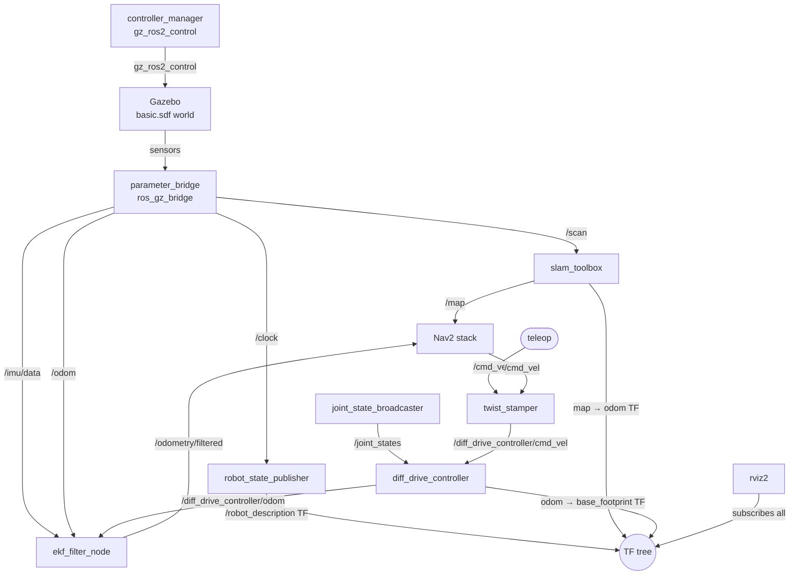

# sim.launch.py

Launches the full Gazebo simulation stack for the ubot. This is the simulation equivalent of `real_robot.launch.py` — it brings up the robot in a Gazebo world with all controllers, SLAM Toolbox, RViz, Nav2 stack, and EKF sensor fusion active.

> **Note**: This file contains approximately 120 lines of dead (commented-out) code at lines 209–332 that represent an older version of the launch setup. Only the active code (lines 1–207) is documented below. See [Known issues](#known-issues).

## Quick start

```bash
ros2 launch ubot_bringup sim.launch.py
```

No command-line arguments are accepted. All configuration is hardcoded.

## Arguments

None. This launch file does not declare any `DeclareLaunchArgument` entries.

## Launched nodes and actions

Listed in the order they appear in the returned `LaunchDescription`.

| Action | Package / source | Key configuration |
|---|---|---|
| `robot_state_publisher` | `robot_state_publisher` | `robot_description` from xacro with `use_gazebo:=true`, `use_sim_time: true` |
| Gazebo (`gz_sim.launch.py`) | `ros_gz_sim` | World: `ubot_bringup/worlds/basic.sdf`; flags: `-r -v 4` (run immediately, verbosity 4) |
| `parameter_bridge` | `ros_gz_bridge` | Bridges listed below |
| `create` (spawn robot) | `ros_gz_sim` | Topic: `robot_description`; name: `ubot`; world: `sensors`; z offset: 0.1 m |
| `twist_stamper` | `twist_stamper` | `frame_id: base_footprint`, `use_sim_time: true`; remappings: `/cmd_vel_in` → `/cmd_vel`, `/cmd_vel_out` → `/diff_drive_controller/cmd_vel` |
| `joint_state_broadcaster` spawner | `controller_manager` | Config: `sim_ubot_controllers.yaml`; launched via `OnProcessExit(spawn_entity)` event |
| `diff_drive_controller` spawner | `controller_manager` | Config: `sim_ubot_controllers.yaml`; launched via `OnProcessExit(spawn_entity)` event |
| `ekf_filter_node` | `robot_localization` | Config: `sim_ekf.yaml` (`use_sim_time: true`, 50 Hz, IMU source: `/imu/data`) |
| `rviz2` | `rviz2` | Config: `ubot_description/rviz/slam.rviz`; `use_sim_time: true` |
| SLAM Toolbox (`online_async_launch.py`) | `slam_toolbox` | Config: `mapper_params_online_async.yaml`; `use_sim_time: true` |
| Nav2 (`navigation_launch.py`) | `nav2_bringup` | Config: `sim_nav2_params.yaml`; `use_sim_time: true` |

### ROS-Gazebo bridge topics

The `parameter_bridge` (ros_gz_bridge) translates the following Gazebo topics to ROS 2:

| Gz topic | ROS topic | Message type | Direction |
|---|---|---|---|
| `/clock` | `/clock` | `rosgraph_msgs/Clock` | Gz → ROS |
| `/cmd_vel` | `/cmd_vel` | `geometry_msgs/Twist` | ROS → Gz |
| `/odom` | `/odom` | `nav_msgs/Odometry` | Gz → ROS |
| `/scan` | `/scan` | `sensor_msgs/LaserScan` | Gz → ROS |
| `/camera/image` | `/camera/rgb/image_raw` | `sensor_msgs/Image` | Gz → ROS |
| `/camera/depth_image` | `/camera/depth/image_raw` | `sensor_msgs/Image` | Gz → ROS |
| `/camera/points` | `/camera/points` | `sensor_msgs/PointCloud2` | Gz → ROS |
| `/camera/camera_info` | `/camera/rgb/camera_info` | `sensor_msgs/CameraInfo` | Gz → ROS |
| `/imu` | `/imu/data` | `sensor_msgs/Imu` | Gz → ROS |

Note: the `/tf` bridge (`/tf@tf2_msgs/msg/TFMessage[gz.msgs.Pose_V`) is present in the bridge arguments list as a comment — it was intentionally disabled in the active code.

### Controller sequencing

Controller spawners are launched via a `RegisterEventHandler(OnProcessExit(...))` trigger: both `joint_state_broadcaster` and `diff_drive_controller` are spawned only after the `create` (robot spawn) process exits cleanly. This avoids the timer-based delay used in `real_robot.launch.py` and instead uses a deterministic event: the robot must be fully spawned in Gazebo before controllers attempt to claim interfaces.

## Simulation vs real robot — key differences

| Aspect | `real_robot.launch.py` | `sim.launch.py` |
|---|---|---|
| Hardware interface | `ubot_control/UbotHardware` (ESP32 serial) | `gz_ros2_control/GazeboSimSystem` |
| Controller config | `ubot_controllers.yaml` (30 Hz) | `sim_ubot_controllers.yaml` (50 Hz) |
| Wheels in controller | Front 2 only (encoder feedback) | All 4 wheels (fully actuated in sim) |
| IMU topic | `/bno055/imu` (hardware) | `/imu/data` (Gazebo sensor, bridged) |
| EKF IMU source (`sim_ekf.yaml`) | `/bno055/imu` | `/imu/data` |
| EKF frequency | 30 Hz | 50 Hz |
| Odom topic used by Nav2 (`sim_nav2_params.yaml`) | `/diff_drive_controller/odom` | `/odometry/filtered` (EKF output) |
| Controller spawn trigger | TimerAction (5 s / 6 s) | `OnProcessExit(spawn_entity)` |
| SLAM Toolbox | Not included | Included (online async) |
| Nav2 | Not included | Included |
| `use_sim_time` | false | true |

## Topic graph



## Known issues

| Ref | Description | Severity |
|---|---|---|
| [#i5](../issues.md#i5) | ~120 lines of dead commented-out code at lines 209–332 in `sim.launch.py`. The commented code represents an older version using the real-robot controller config and without IMU/EKF/Nav2. Should be removed to reduce confusion. | Low |

## See also

- [real_robot.launch.py](real_robot.md) — physical robot equivalent
- [Configuration: sim_ubot_controllers.yaml](../configuration/sim_ubot_controllers.md)
- [Configuration: sim_ekf.yaml](../configuration/sim_ekf.md)
- [Configuration: sim_nav2_params.yaml](../configuration/sim_nav2_params.md)
