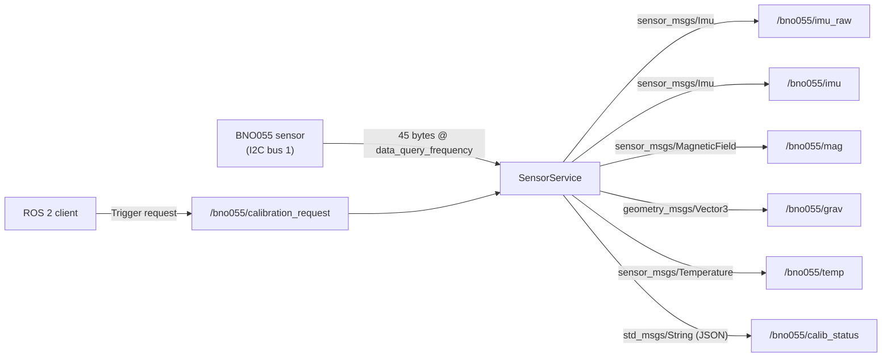

# bno055

Vendored IMU driver for the Bosch BNO055 9-DOF sensor. Upstream author: Evan Flynn (flynneva). This package is included in the workspace as a vendored copy; it is **not** a ubot-developed package.

## Overview

| Field | Value |
|---|---|
| Package name | `bno055` |
| Version | `0.5.0` |
| License | BSD |
| Build type | `ament_python` |
| Upstream maintainer | flynneva (evanflynn.msu@gmail.com) |
| Transport options | I2C (via `python3-smbus`) or UART (via `python3-serial`) |

The package provides a single ROS 2 node (`Bno055Node`) that reads sensor data from the BNO055 over I2C or UART and publishes it as standard ROS message types. `SensorService` (a plain Python class, not a Node subclass) is composed into `Bno055Node` and owns all publisher and service creation.

## Node

**Class:** `Bno055Node(Node)` (in `bno055/bno055.py`)
**ROS node name:** `bno055` (set in `super().__init__('bno055')`)

### How to run

```bash
# Minimal (uses all defaults):
ros2 run bno055 bno055

# With a parameter file:
ros2 run bno055 bno055 --ros-args --params-file /path/to/bno055_params.yaml

# Via the package's own launch file:
ros2 launch bno055 bno055.launch.py

# The node is also defined (but currently excluded from LaunchDescription) in:
ros2 launch ubot_bringup real_robot.launch.py  # bno055 is COMMENTED OUT — see Known Issues
```

The executable entry point is defined in `setup.py`:

```python
'bno055 = bno055.bno055:main'
```

### Timer-based data loop

Two periodic timers are created after `setup()`:

- **`data_query_timer`** — calls `sensor.get_sensor_data()` at `data_query_frequency` Hz (default 10 Hz). A `threading.Lock` prevents overlapping queries.
- **`status_timer`** — calls `sensor.get_calib_status()` at `calib_status_frequency` Hz (default 0.1 Hz).

## Topics

All topic names are prefixed by the `ros_topic_prefix` parameter (default `'bno055/'`).

| Topic | Message Type | QoS (depth) | Description |
|---|---|---|---|
| `bno055/imu_raw` | `sensor_msgs/Imu` | 10 | Raw IMU data. `orientation_covariance` field is populated from the `variance_orientation` parameter (see Known Issues — TODO about making this optional). |
| `bno055/imu` | `sensor_msgs/Imu` | 10 | Filtered IMU data. Quaternion is manually normalized (see Known Issues). `orientation_covariance` is reused from `imu_raw_msg`. |
| `bno055/mag` | `sensor_msgs/MagneticField` | 10 | Magnetometer reading with covariance from `variance_mag`. |
| `bno055/grav` | `geometry_msgs/Vector3` | 10 | Gravity vector. No covariance field — `Vector3` message type has none; this is a message-type limitation, not a bug. |
| `bno055/temp` | `sensor_msgs/Temperature` | 10 | Board temperature in degrees Celsius. |
| `bno055/calib_status` | `std_msgs/String` | 10 | JSON string with calibration quality (0–3 scale): `{"sys": N, "gyro": N, "accel": N, "mag": N}`. Bit-shifted from the BNO055 CALIB_STAT register. |

## Services

| Service | Type | Description |
|---|---|---|
| `bno055/calibration_request` | `example_interfaces/Trigger` | Switches sensor to config mode, reads all calibration offset registers (accel, mag, gyro offsets + radii), switches back to NDOF mode, and returns the raw data as a string in the `response.message` field. `response.success` is always `True` if the mode transitions do not raise. |

## Parameters

All parameters are declared in `bno055/params/NodeParameters.py`.

| Parameter | Type | Default | Description |
|---|---|---|---|
| `ros_topic_prefix` | string | `'bno055/'` | Prefix prepended to all published topic names. |
| `connection_type` | string | `'uart'` | Communication bus: `'uart'` or `'i2c'`. |
| `i2c_bus` | int | `0` | I2C bus number (used only when `connection_type='i2c'`). |
| `i2c_addr` | int | `0x28` | I2C device address (used only when `connection_type='i2c'`). |
| `uart_port` | string | `'/dev/ttyUSB0'` | UART device path (used only when `connection_type='uart'`). |
| `uart_baudrate` | int | `115200` | UART baud rate. |
| `uart_timeout` | float | `0.1` | UART read timeout in seconds. |
| `frame_id` | string | `'bno055'` | TF frame ID stamped on all published messages. |
| `data_query_frequency` | int | `10` | Hz — how often sensor data is read and published. |
| `calib_status_frequency` | float | `0.1` | Hz — how often calibration status is logged/published. |
| `operation_mode` | int | `0x0C` | BNO055 operation mode register value (0x0C = NDOF). |
| `placement_axis_remap` | string | `'P1'` | Sensor mount position. Valid values: `'P0'`–`'P7'`. See Configuration Notes. |
| `acc_factor` | float | `100.0` | Raw accelerometer divisor (1 LSB = 0.01 m/s²). |
| `mag_factor` | float | `16000000.0` | Raw magnetometer divisor. |
| `gyr_factor` | float | `900.0` | Raw gyroscope divisor. |
| `grav_factor` | float | `100.0` | Raw gravity vector divisor. |
| `set_offsets` | bool | `False` | If `True`, write calibration offset values to sensor hardware on startup. |
| `offset_acc` | int[3] | `DEFAULT_OFFSET_ACC` (from registers.py) | Accelerometer calibration offsets [x, y, z]. |
| `offset_mag` | int[3] | `DEFAULT_OFFSET_MAG` | Magnetometer calibration offsets. |
| `offset_gyr` | int[3] | `DEFAULT_OFFSET_GYR` | Gyroscope calibration offsets. |
| `radius_acc` | int | `DEFAULT_RADIUS_ACC` | Accelerometer radius calibration value. |
| `radius_mag` | int | `DEFAULT_RADIUS_MAG` | Magnetometer radius calibration value. |
| `variance_acc` | float[3] | `DEFAULT_VARIANCE_ACC` | Accelerometer variance [x, y, z] for covariance matrix. |
| `variance_angular_vel` | float[3] | `DEFAULT_VARIANCE_ANGULAR_VEL` | Gyroscope variance [x, y, z]. |
| `variance_orientation` | float[3] | `DEFAULT_VARIANCE_ORIENTATION` | Orientation variance [x, y, z]. |
| `variance_mag` | float[3] | `DEFAULT_VARIANCE_MAG` | Magnetometer variance [x, y, z]. |

## Configuration Notes

### I2C vs UART Mode

Set `connection_type` to select the transport:

- **I2C**: Configure `i2c_bus` and `i2c_addr`. Requires `python3-smbus`.
- **UART**: Configure `uart_port` and `uart_baudrate`. Requires `python3-serial`.

The ubot deployment uses **I2C** (see `bno055_params.yaml` below).

### Mount Positions (P0–P7)

`placement_axis_remap` selects the sensor orientation relative to the board. Each position maps to a 2-byte register pair written to `BNO055_AXIS_MAP_CONFIG_ADDR`:

| Position | Bytes (hex) | Notes |
|---|---|---|
| P0 | `\x21\x04` | |
| P1 | `\x24\x00` | Package default |
| P2 | `\x24\x06` | **ubot deployment** |
| P3 | `\x21\x02` | |
| P4 | `\x24\x03` | |
| P5 | `\x21\x02` | |
| P6 | `\x21\x07` | |
| P7 | `\x24\x05` | |

### Calibration Offsets

If `set_offsets: true`, offsets are written one register at a time during `configure()`. The `calibration_request` service can be called at runtime to read back the current hardware calibration state.

### Deployment Config (ubot_bringup/config/bno055_params.yaml)

The actual values used on the real robot (from `/home/chibueze/uni-bot/src/ubot/ubot_bringup/config/bno055_params.yaml`):

```yaml
bno055:
  ros__parameters:
    ros_topic_prefix: "bno055/"
    connection_type: "i2c"
    i2c_bus: 1
    i2c_addr: 0x28
    data_query_frequency: 100
    calib_status_frequency: 0.1
    frame_id: "imu_link"
    operation_mode: 0x0C
    placement_axis_remap: "P2"
    acc_factor: 100.0
    mag_factor: 16000000.0
    gyr_factor: 900.0
    grav_factor: 100.0
    set_offsets: false
    offset_acc: [0xFFEC, 0x00A5, 0xFFE8]
    offset_mag: [0xFFB4, 0xFE9E, 0x027D]
    offset_gyr: [0x0002, 0xFFFF, 0xFFFF]
```

Key differences from package defaults: I2C mode on bus 1, `frame_id` set to `imu_link` (matches URDF), `data_query_frequency` raised to 100 Hz, `placement_axis_remap` set to `P2` (reflects actual physical mount orientation), `set_offsets: false` (offsets are listed but not applied at startup).

## Node Communication Diagram



## Known Issues

### Issue — BNO055 + EKF not launched on real robot (Medium-High)

`bno055_node` is defined in `real_robot.launch.py` (lines ~101–107) but the line adding it to the `LaunchDescription` is commented out (`# bno055_node,` at line ~125). Likewise, `ekf_node` is entirely commented out. The real robot therefore navigates on wheel-odometry alone, with no IMU fusion, despite `real_ekf.yaml` being fully written and ready. See also [ubot_bringup](ubot_bringup.md).

### TODO — Header sequence counters (SensorService.py ~line 154)

```python
# TODO: do headers need sequence counters now?
# imu_raw_msg.header.seq = seq
```

ROS 2 removed `header.seq`; this is a leftover comment from a ROS 1 port. Low severity — the commented-out code has no runtime effect.

### TODO — `orientation_covariance` option (SensorService.py ~lines 157, 189)

```python
# TODO: make this an option to publish?
```

Both `imu_raw` and `imu` messages populate `orientation_covariance` unconditionally from `variance_orientation`. The TODO requests a parameter flag to make this optional. Currently `imu_msg.orientation_covariance` is literally `imu_raw_msg.orientation_covariance` (same object reference reused at line 208).

### TODO — Hand-rolled quaternion normalization (SensorService.py ~line 200)

```python
# TODO(flynneva): replace with standard normalize() function
norm = sqrt(q.x * q.x + q.y * q.y + q.z * q.z + q.w * q.w)
```

Normalization is correct but uses a local square-root calculation instead of a library call. Low severity — cosmetic / maintainability.

### Bug — Unguarded dict lookup for `placement_axis_remap`

In `configure()` (SensorService.py line ~109):

```python
mount_positions[self.param.placement_axis_remap.value]
```

If `placement_axis_remap` is set to any value outside `'P0'`–`'P7'`, this raises an unhandled `KeyError` with a confusing traceback rather than a descriptive error message. The fix is a guard before the lookup:

```python
if self.param.placement_axis_remap.value not in mount_positions:
    raise ValueError(f"Invalid placement_axis_remap: {self.param.placement_axis_remap.value!r}. Must be P0–P7.")
```

### Startup failure mode

`configure()` calls `sys.exit(1)` if the chip ID read fails. There is no retry or recovery path. The node must be restarted manually after a communication failure.

## Bundled Documentation

The package ships its own Sphinx-based documentation under `bno055/docs/`. This is the upstream vendor documentation and is separate from the ubot docs site.

## See Also

- [ubot_bringup](ubot_bringup.md) — deployment launch files and `bno055_params.yaml`
- [ubot_description](ubot_description.md) — `imu_link` frame definition in URDF
- `real_ekf.yaml` — EKF configuration that would fuse `bno055/imu` with wheel odometry
