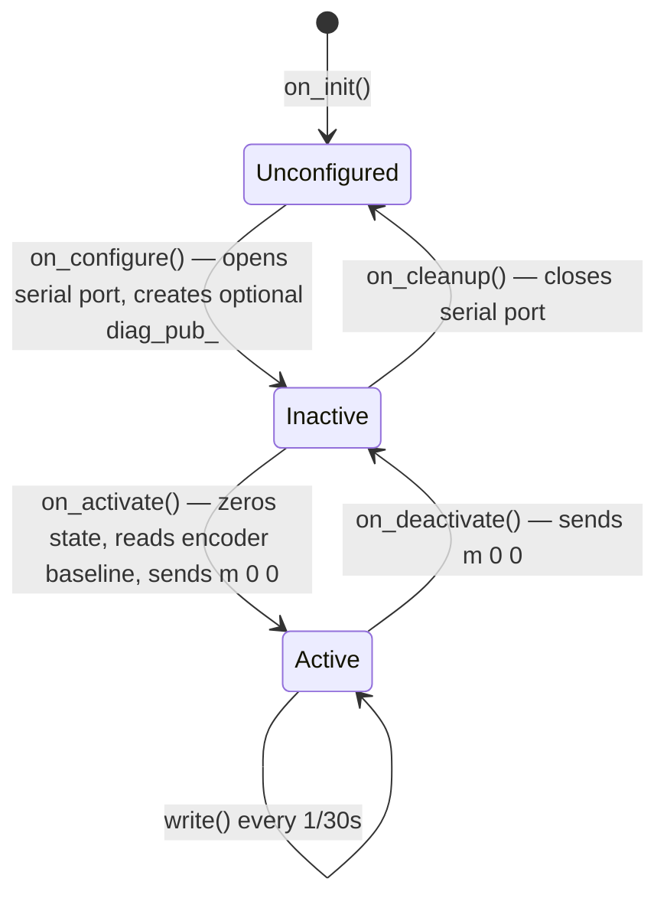
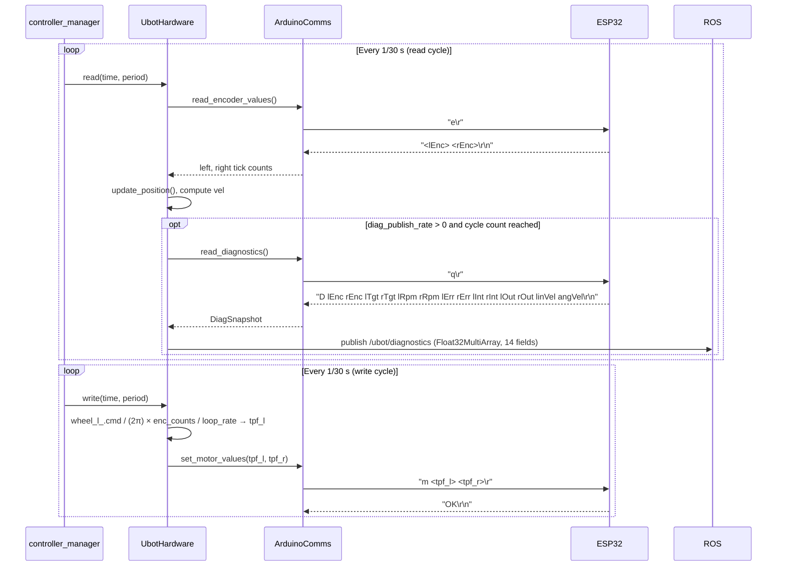

# ubot_control

The `ros2_control` hardware interface plugin that bridges the ROS 2 control stack to the ESP32 motor controller over a serial UART connection.

## Overview

| Field | Value |
|---|---|
| Package name | `ubot_control` |
| Version | `0.0.0` |
| License | BSD-3-Clause |
| Build type | `ament_cmake` |
| Maintainer | chibueze (praiseorji4@gmail.com) |
| Plugin class | `ubot_control::UbotHardware` |
| Plugin base class | `hardware_interface::SystemInterface` |
| Plugin name (for URDF) | `ubot_control/UbotHardware` |
| Serial library | `libserial` (via PkgConfig) |

## Role

`ubot_control` is the translation layer between the ROS 2 `controller_manager` and the ESP32 running `Ros-esp32_bridge.ino`. It:

1. Opens a serial connection to the ESP32 on `/dev/ttyUSB0`.
2. Each `read()` cycle: sends `'e\r'` → receives encoder counts → computes wheel position and velocity.
3. Each `write()` cycle: converts `diff_drive_controller` velocity commands (rad/s) → ticks-per-frame → sends `'m L R\r'`.
4. Optionally polls `'q\r'` for a full diagnostic snapshot and publishes it as `/ubot/diagnostics`.

## Plugin Registration

The plugin is declared in `ubot_control.xml`:

```xml
<library path="ubot_control">
  <class name="ubot_control/UbotHardware"
         type="ubot_control::UbotHardware"
         base_class_type="hardware_interface::SystemInterface">
    <description>Diff drive hardware interface for Ubot robot</description>
  </class>
</library>
```

`CMakeLists.txt` exports this via:
```cmake
pluginlib_export_plugin_description_file(hardware_interface ubot_control.xml)
```

The URDF's `ubot_ros2_control.xacro` references the plugin as `ubot_control/UbotHardware`.

## Source Files

| File | Role |
|---|---|
| `include/ubot_control/ubot_hardware_interface.hpp` | Class declaration, `Config` struct with all URDF parameters, private members. |
| `src/ubot_hardware_interface.cpp` | All lifecycle method implementations, read/write logic, diagnostics publisher. |
| `include/ubot_control/arduino_comms.hpp` | `ArduinoComms` class (libserial wrapper), `DiagSnapshot` struct, all serial command methods. |
| `include/ubot_control/wheel.hpp` | `Wheel` struct — per-wheel encoder, position, velocity, command state. |

## Hardware Interface Lifecycle



### on_init()

Parses all URDF `<ros2_control>` hardware parameters. Validates that exactly 4 joints are declared. Validates that each joint has exactly 2 state interfaces and 0 or 1 command interface (velocity only).

### on_configure()

Opens the serial port via `ArduinoComms::connect()`. If the port cannot be opened, returns `ERROR`. Creates the optional `/ubot/diagnostics` publisher if `diag_publish_rate > 0`.

### on_activate()

Zeros all wheel state (`enc`, `pos`, `vel`, `cmd`). Reads current encoder counts from the ESP32 and sets `last_enc` to that value so the first `read()` delta is zero. Sends `m 0 0` to stop the robot.

### on_deactivate()

Sends `m 0 0` to stop the robot.

### on_cleanup()

Calls `ArduinoComms::disconnect()`. Sets `diag_pub_` to `nullptr`.

## State Interfaces (Exported)

8 state interfaces total — 4 wheels × (position + velocity):

| Interface | Backed By |
|---|---|
| `front_left_wheel_joint/position` | `wheel_l_.pos` |
| `front_left_wheel_joint/velocity` | `wheel_l_.vel` |
| `front_right_wheel_joint/position` | `wheel_r_.pos` |
| `front_right_wheel_joint/velocity` | `wheel_r_.vel` |
| `rear_left_wheel_joint/position` | `wheel_l_.pos` (pointer alias — mirrors front left) |
| `rear_left_wheel_joint/velocity` | `wheel_l_.vel` (mirror) |
| `rear_right_wheel_joint/position` | `wheel_r_.pos` (mirror) |
| `rear_right_wheel_joint/velocity` | `wheel_r_.vel` (mirror) |

Rear wheels are mechanically slaved to front wheels via belt drive; they share the same `double` memory as the front wheels. They have no independent encoder.

## Command Interfaces (Exported)

2 command interfaces — front wheels only:

| Interface | Backed By |
|---|---|
| `front_left_wheel_joint/velocity` | `wheel_l_.cmd` (rad/s) |
| `front_right_wheel_joint/velocity` | `wheel_r_.cmd` (rad/s) |

Rear joints have **no command interface** on real hardware. In Gazebo simulation (`use_gazebo:=true`), the URDF adds velocity command interfaces to the rear joints as well — see `ubot_ros2_control.xacro`.

## URDF Parameters (parsed in on_init())

All parameters are read from the `<ros2_control>` tag in `ubot_ros2_control.xacro`:

| Parameter | Type | Value (real hardware) | Description |
|---|---|---|---|
| `left_wheel_name` | string | `front_left_wheel_joint` | Name of the left wheel joint in the URDF. |
| `right_wheel_name` | string | `front_right_wheel_joint` | Name of the right wheel joint in the URDF. |
| `enc_counts_per_rev_left` | int | `3956` | Encoder counts per full revolution, left wheel. Must match `ENC_CPR_LEFT` in `diff_controller.h`. |
| `enc_counts_per_rev_right` | int | `3956` | Encoder counts per full revolution, right wheel. |
| `wheel_separation` | double | `0.264204` | Distance between wheel contact points (metres). Must match ESP32 and `diff_drive_controller`. |
| `wheel_radius` | double | `0.033` | Wheel radius in metres. |
| `serial_device` | string | `/dev/ttyUSB0` | Serial port for ESP32 communication. |
| `baud_rate` | int | `115200` | Serial baud rate. Must match `Serial.begin()` in the ESP32 firmware. |
| `serial_timeout_ms` | int | `1000` | Read timeout in milliseconds (passed to `ArduinoComms::connect()`). |
| `loop_rate` | double | `30.0` | Control rate in Hz. Comment in source: "must match PID_RATE in diff_controller.h". Used in ticks-per-frame calculation. |
| `diag_publish_rate` | int | `0` | 0 = disabled. N > 0 = publish `/ubot/diagnostics` every N `read()` cycles. |

`diag_publish_rate` is the only optional parameter — defaults to `0` if absent from the URDF tag.

## Serial Command Flow



### Ticks-Per-Frame Conversion (write())

```cpp
// wheel.cmd is in rad/s (from diff_drive_controller)
const double rps_l = wheel_l_.cmd / (2.0 * M_PI);
const int tpf_l = static_cast<int>(rps_l * cfg_.enc_counts_per_rev_left / cfg_.loop_rate);
comms_.set_motor_values(tpf_l, tpf_r);
```

This sends `'m <tpf_l> <tpf_r>\r'` to the ESP32, which interprets the values as signed ticks-per-PID-frame.

### Velocity Computation (read())

```cpp
const double prev_pos_l = wheel_l_.pos;
wheel_l_.update_position();   // pos += (enc - last_enc) * rads_per_count
wheel_l_.vel = (dt > 0.0) ? (wheel_l_.pos - prev_pos_l) / dt : 0.0;
```

## Topics

| Topic | Message Type | QoS (depth) | Description |
|---|---|---|---|
| `/ubot/diagnostics` | `std_msgs/Float32MultiArray` | 10 | Optional. Published every `diag_publish_rate` read() cycles when `diag_publish_rate > 0`. 14 float fields in this order: l_enc, r_enc, l_tgt_rpm, r_tgt_rpm, l_rpm, r_rpm, l_err, r_err, l_int, r_int, l_out, r_out, lin_vel, ang_vel. |

## The ArduinoComms Command Protocol

Defined in `arduino_comms.hpp`. All commands are terminated with `\r`. Responses are read until `\n`.

| Command | Sent String | Expected Response | Method |
|---|---|---|---|
| Read encoders | `"e\r"` | `"<lEnc> <rEnc>\r\n"` | `read_encoder_values()` |
| Set motor speed | `"m <L> <R>\r"` | `"OK\r\n"` | `set_motor_values()` |
| Set both PIDs | `"u Kp:Kd:Ki:Min\r"` | `"OK\r\n"` | `set_pid_values()` |
| Set left PID | `"l Kp:Ki:Kd:Min\r"` | `"OK\r\n"` | `set_pid_values_left()` |
| Set right PID | `"f Kp:Ki:Kd:Min\r"` | `"OK\r\n"` | `set_pid_values_right()` |
| Diagnostics snapshot | `"q\r"` | `"D <14 fields>\r\n"` | `read_diagnostics()` |

Note: The `'u'` command uses order `Kp:Kd:Ki:Min` (note Kd before Ki), while `'l'` and `'f'` use `Kp:Ki:Kd:Min`. This matches the ESP32 firmware's `commands.h`.

If `ArduinoComms::read_encoder_values()` gets a read timeout or a parse error, it silently returns without updating the caller's values. This means stale encoder data is used for that cycle — logged to stderr as `[ArduinoComms] Encoder parse error, skipping frame.`

## Build

```cmake
add_library(ubot_control SHARED src/ubot_hardware_interface.cpp)

find_package(PkgConfig REQUIRED)
pkg_check_modules(LIBSERIAL REQUIRED libserial)
# libserial linked AFTER ament_target_dependencies
target_link_libraries(ubot_control ${LIBSERIAL_LIBRARIES})

pluginlib_export_plugin_description_file(hardware_interface ubot_control.xml)
```

The shared library is installed to `lib/`. Header files are installed to `include/`. The plugin XML is installed to `share/ubot_control/`.

## Known Issues

### PID Gains are Untuned Starting Values

The ESP32 firmware (`diff_controller.h`) contains this comment at line 44:

> "Starting gains — re-tune after flashing (previous values were calibrated with a double min_pwm bug)"

Current gains: `leftKp=rightKp=5.0`, `leftKi=rightKi=9.0`, `leftKd=rightKd=0.0`. These are explicitly marked as initial values pending re-calibration, not validated final tuning. Severity: Low/Informational (self-documented by the firmware author).

### Serial Timeout Behavior

A read timeout on any `send_msg()` call logs to `stderr` and returns an empty string. For encoder reads, the last known values are silently retained. For motor commands, the response is discarded. There is no attempt to reinitialize the connection.

## See Also

- [ubot_bringup](ubot_bringup.md) — `ubot_controllers.yaml` configures `diff_drive_controller` and `joint_state_broadcaster`
- [ubot_description](ubot_description.md) — `ubot_ros2_control.xacro` defines the plugin name and all URDF parameters
- [ubot_debugger](ubot_debugger.md) — alternative diagnostics path via separate serial connection
- Hardware guide — ESP32 firmware (`Ros-esp32_bridge.ino`) and command protocol details
