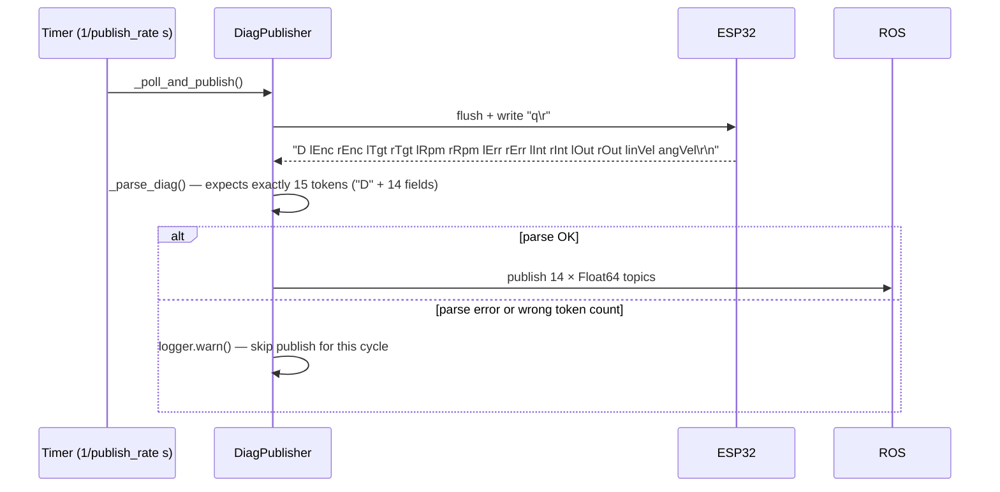

# ubot_debugger

A standalone diagnostic tool that polls the ESP32's `'q'` command over serial and republishes each field as a separate named ROS 2 topic, making it easy to plot motor controller internals in PlotJuggler.

## Overview

| Field | Value |
|---|---|
| Package name | `ubot_debugger` |
| Version | `0.0.0` |
| License | ⚠️ `TODO: License declaration` — license field not filled in `package.xml` or `setup.py` |
| Build type | `ament_python` |
| Maintainer | chibueze (praiseorji4@gmail.com) |
| Status | **Not included in any launch file** — must be run manually |

## Node

**Class:** `DiagPublisher(Node)` (in `ubot_debugger/diag_publisher.py`)
**ROS node name:** `horizon_diag_publisher` (set in `super().__init__('horizon_diag_publisher')`)

The node name uses the robot's informal internal name "Horizon" (see naming note below).

## How to Run

```bash
# Default parameters (serial_port=/dev/ttyUSB0, baud_rate=115200, publish_rate=10.0 Hz):
ros2 run ubot_debugger diag_publisher

# Custom parameters:
ros2 run ubot_debugger diag_publisher \
  --ros-args -p serial_port:=/dev/ttyUSB0 -p baud_rate:=115200 -p publish_rate:=10.0
```

The executable entry point is defined in `setup.py`:

```python
'diag_publisher = ubot_debugger.diag_publisher:main'
```

The node is **not** included in `real_robot.launch.py` or any other bringup launch file. It must be run in a separate terminal after the main bringup is started.

## Parameters

| Parameter | Type | Default | Description |
|---|---|---|---|
| `serial_port` | string | `/dev/ttyUSB0` | Serial device to poll. This is the same port used by `ubot_control` (ESP32 motor controller). Both cannot have the port open simultaneously — run `ubot_debugger` only when `controller_manager` is not running, or use the `/ubot/diagnostics` topic from `ubot_control` instead. |
| `baud_rate` | int | `115200` | Serial baud rate. |
| `publish_rate` | float | `10.0` | Publishing rate in Hz. Source code comment: **keep ≤ 15 Hz to avoid saturating the serial command channel**. |

## Topics Published

All 14 topics are `std_msgs/Float64`, QoS depth 10. They map 1:1 to the fields in the ESP32's `'q'` diagnostic response.

| Topic | Field | Description |
|---|---|---|
| `/horizon/diag/enc/left` | `l_enc` | Raw encoder tick count, left wheel. |
| `/horizon/diag/enc/right` | `r_enc` | Raw encoder tick count, right wheel. |
| `/horizon/diag/rpm/left_target` | `l_tgt` | PID target RPM, left. |
| `/horizon/diag/rpm/right_target` | `r_tgt` | PID target RPM, right. |
| `/horizon/diag/rpm/left_actual` | `l_rpm` | Filtered actual RPM (Jimeno low-pass filter), left. |
| `/horizon/diag/rpm/right_actual` | `r_rpm` | Filtered actual RPM, right. |
| `/horizon/diag/pid/left_error` | `l_err` | PID error (target − actual RPM), left. |
| `/horizon/diag/pid/right_error` | `r_err` | PID error, right. |
| `/horizon/diag/pid/left_integral` | `l_int` | PID integral accumulator (clamped ±50), left. |
| `/horizon/diag/pid/right_integral` | `r_int` | PID integral accumulator, right. |
| `/horizon/diag/pid/left_output` | `l_out` | Final PWM output (−255 to 255), left. |
| `/horizon/diag/pid/right_output` | `r_out` | Final PWM output, right. |
| `/horizon/diag/vel/linear` | `lin_vel` | Computed body linear velocity in m/s: `(vL + vR) / 2`. |
| `/horizon/diag/vel/angular` | `ang_vel` | Computed body angular velocity in rad/s: `(vR − vL) / WHEEL_SEPARATION_M`. |

## How It Works



### Parse Logic

`_parse_diag()` splits the response on whitespace and expects exactly 15 tokens: `'D'` followed by 14 numeric fields. A mismatch in token count logs a warning and returns `None`, skipping the publish for that cycle. A `ValueError` (non-numeric field) also logs and returns `None`. The node does **not** exit or reconnect on parse errors — it simply tries again on the next timer tick.

## Startup and Failure Behaviour

In `__init__()`, if the serial port cannot be opened:

```python
except serial.SerialException as e:
    self.get_logger().fatal(f'Cannot open serial port: {e}')
    raise SystemExit(1)
```

The node exits immediately with `SystemExit(1)`. There is no retry loop. Subsequent serial errors during operation (in `_send_command()`) are logged as warnings and the poll cycle is skipped, but the node continues running.

`destroy_node()` cleanly closes the serial port:

```python
def destroy_node(self):
    if self._ser and self._ser.is_open:
        self._ser.close()
    super().destroy_node()
```

## Serial Port Conflict Warning

`ubot_debugger` connects to `/dev/ttyUSB0` (the ESP32 command channel), the same port used by `ubot_control/UbotHardware`. **Only one process may hold the port open at a time.** Running `diag_publisher` while `controller_manager` is active will cause one of them to fail to open the port.

Workarounds:

1. Run `diag_publisher` only when `controller_manager` is stopped.
2. Use the `/ubot/diagnostics` topic published by `UbotHardware` instead (enabled by setting `diag_publish_rate > 0` in the URDF). That path uses the same serial port cooperatively within the hardware interface's `read()` cycle.

## Naming Note

The node name `horizon_diag_publisher` and all topic paths (`/horizon/diag/...`) use the robot's informal internal name "Horizon". This matches the naming seen in `ubot_controllers.yaml` header ("Horizon (4WD, front encoders only)"). "Horizon" and "ubot" refer to the same physical robot; "ubot" is the ROS package/URDF name.

## Known Issues

### Not Included in Any Launch File (Low)

`diag_publisher` is not referenced in any bringup launch file. It must be invoked manually in a separate terminal. This is intentional as a diagnostic tool but means it is easy to forget. A future improvement would be to add it as an optional conditional inclusion in `real_robot.launch.py`.

### License Field Not Filled In (Low / Cosmetic)

Both `package.xml` and `setup.py` have `license: 'TODO: License declaration'`. This should be updated to a valid SPDX identifier (e.g., `BSD-3-Clause` to match the other ubot packages).

### No Auto-Reconnect on Serial Failure

After startup, if a `SerialException` occurs in `_send_command()`, the node logs a warning and skips the cycle but does not attempt to close and reopen the serial connection. A persistent hardware error requires manual node restart.

## See Also

- [ubot_control](ubot_control.md) — hardware interface that also has an optional `/ubot/diagnostics` publisher (alternative to this node)
- [ubot_bringup](ubot_bringup.md) — launch files (none currently include this node)
- Hardware guide — ESP32 `'q'` command and the 14-field diagnostic frame format
